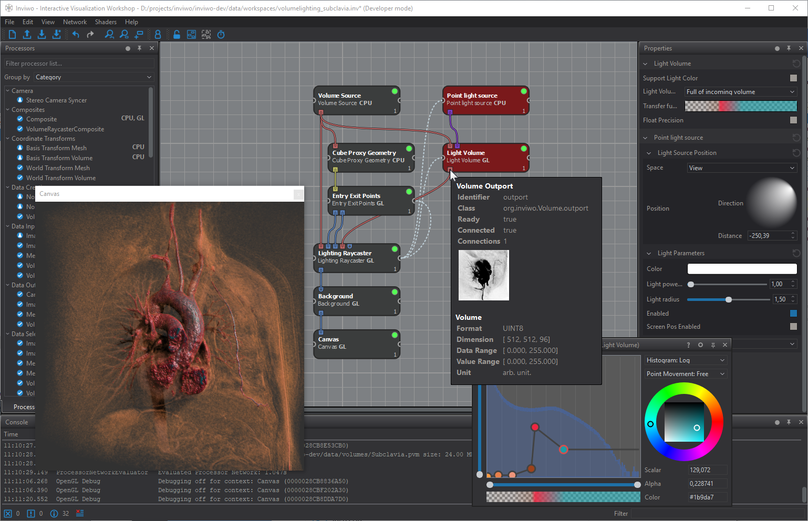
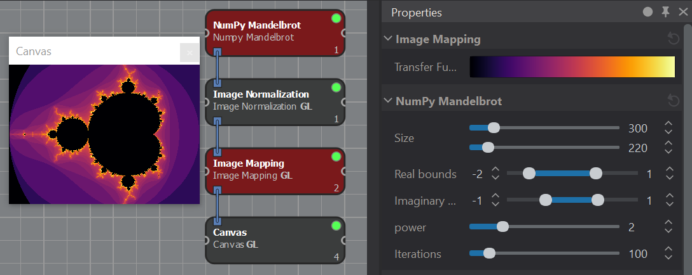

<div align="center">

# Inviwo - Interactive Visualization Workshop

[](http://jenkins.inviwo.org:8080/job/inviwo/job/master/) [](https://github.com/inviwo/inviwo/blob/master/LICENSE)
[](https://github.com/inviwo/inviwo/releases/latest)
[](https://join.slack.com/t/inviwo/shared_invite/enQtNTc2Nzc2NDQwNzIxLTRiMWM1ZWJiYjljZjkwNWE3OTk3MzYxODZlMDUyMzRmZjUzMzBiZjVhNTM3NWUyNzU1MjI4OWJjMzdkODViMzM)




</div>

<br>

## Introduction
Inviwo is a powerful visualization framework designed for scientists, researchers, and developers who need to transform complex data into meaningful visual representations. Whether you're working with medical imaging, scientific simulations, or data analysis, Inviwo provides an intuitive platform for building customized visualization solutions.

With its visual programming interface, you can rapidly prototype complex data processing workflows by connecting components in a visual graph. The framework is designed to be flexible, allowing you to add new functionality with both Python and C++ depending on your preference and needs. More information is available at [www.inviwo.org](http://www.inviwo.org).

**Why you might want to use Inviwo:**

✅ Freely available for commercial use under the Simplified BSD License.<br>
✅ Cross-platform and runs on Windows, Linux and Mac OS X.<br>
✅ Easily extendable through inclusion of external modules and applications.<br>
✅ Integrated with a GUI for rapid prototyping of data processing pipelines.<br>
✅ Develop in Python or C++, whichever you prefer.

## Main Ideas

- **Visual Programming** - Build complex data processing pipelines through an intuitive drag-and-drop interface without writing code.
- **Interactive Visualization** - Explore your data dynamically with real-time interaction and immediate visual feedback.
- **Multi-language Support** - Develop processors in Python for rapid prototyping or C++ for performance-critical tasks.
- **Extensible Architecture** - Easily extend functionality through modules for specialized domains like medical imaging or molecular visualization.
- **Visual Debugging** - Inspect intermediate results by hovering over data ports, simplifying the debugging process.
- **Data Format Versatility** - Support for numerous data formats including HDF5, DICOM, NIfTI, RAW volumes, and common image formats.
- **Easy Parallel Computing** - Leverage parallel processing on CPUs and GPUs with simplified abstractions to boost performance.
- **Cross-platform Compatibility** - Develop on your platform of choice with full support for Windows, Linux, and macOS.

## Quickstart
There are two main ways to get started with Inviwo. You can either 
install the latest version or build it from source.
### Installing Inviwo 
Using the precompiled version is the easiest way to get started. It allows you to use the visual interface and develop new functionality using Python.

1. [Download](https://github.com/inviwo/inviwo/releases/latest) the latest precompiled version for your platform
2. Extract the archive and run the Inviwo application
3. Use the Getting started window to browse examples, for instance the Mandelbrot set showcasing a processor built using python.



### Build from source
Building Inviwo from source code is the most flexible and allows you to develop new functionality and applications in both C++ and Python. 
- See the [build](https://inviwo.org/manual-gettingstarted-build.html) instructions.

## Documentation
Inviwo uses a data processing pipeline where multiple **processors** are connected through **ports** to form a pipeline, see [the Inviwo network](https://inviwo.org/manual-gettingstarted-network.html). For example, you might have a data reader processor that loads a volume dataset through its outport, which connects to the inport of a visualization processor that renders the volume, and finally connects to a canvas processor that displays the result. These processors could come from different **modules** - like the base module for data I/O, the OpenGL module for rendering, and perhaps a specialized module for particular visualization techniques. The visual programming interface makes it easy to construct these pipelines by dragging and connecting processors, while the modular architecture allows you to extend the system with new processors and capabilities through additional modules.
- A **processor** is a fundamental building block in Inviwo that performs a specific data processing or visualization task.
- A **property** is a configurable parameter of a processor that allows users to control its behavior, such as adjusting visualization parameters, numerical values, or algorithm settings.
- A **port** is a connection point on a processor that allows data to flow in (inport) or out (outport) of the processor.
- A **module** is a collection of related processors, data structures, and utilities that extends Inviwo's functionality for a specific domain or purpose.

Detailed descriptions of how to use and develop new functionality can be found in:
  - [Getting started](https://inviwo.org/manual_index.html) contains videos and high-level descriptions of the user interface and core concepts in Inviwo.
      - [Create Python processors](https://inviwo.org/manual-devguide-python-processors.html) is perhaps the quickest way of extending the Inviwo functionality.
      - [Create C++ processors](https://inviwo.org/manual-devguide-build-processor.html) is the most flexible way of extending the Inviwo functionality.
      - [Create modules](https://inviwo.org/manual-devguide-meta.html) to organize your new functionality.
      - [Build instructions](https://inviwo.org/manual-gettingstarted-build.html) details how to setup your environment.  
  - [API](https://inviwo.org/inviwo/doc) details all classes and functions in Inviwo.
  - [Changelog](/CHANGELOG.md) contains info about new key functionalities and breaking changes.

For help and general discussion join us on our [Slack](https://join.slack.com/t/inviwo/shared_invite/enQtNTc2Nzc2NDQwNzIxLTRiMWM1ZWJiYjljZjkwNWE3OTk3MzYxODZlMDUyMzRmZjUzMzBiZjVhNTM3NWUyNzU1MjI4OWJjMzdkODViMzM) server


## Applications built with Inviwo
The Inviwo framework and data processing pipelines built using the Inviwo network editor can be integrated into your application. Here are two examples that uses the Inviwo framework under the hood: 
- [Visual Neuro](https://github.com/SciVis/VisualNeuro) is a visual analysis tool understanding cohorts of brain imaging and clinical data. 
- [ENVISIoN](https://github.com/rartino/ENVISIoN) visualizes electronic structure quantities from ab-initio calculations.

## Use already implemented techniques from the community
There are a large number of modules developed and maintained in other repositories.
These can be added through the CMake option `IVW_EXTERNAL_MODULES`, see [Inviwo modules](https://github.com/inviwo/modules) for more details.
The following modules add a variety of functionalities to Inviwo. Please refer to the respective repository for possible issues related to them.

- [Dicom reader](https://github.com/inviwo/modules/tree/master/medvis/dicom) Adds support for reading DICOM image/volume files (.dcm file ending)
- [Molecular visualization](https://github.com/inviwo/modules/tree/master/molvis) Adds support for molecular data structures along with reading PDB and mmCIF files. Molecules are rendered in van-der-Waals, Licorice, and Ball and Stick representations.
-  [Tensor visualization](https://github.com/inviwo/modules/tree/master/tensorvis) Adds support for reading/writing tensor fields. Includes algorithms such as HyperLIC and Anisotropy raycasting.
-  [Topology visualization](https://github.com/inviwo/modules/tree/master/topovis) Integrates the [Topology Toolkit](https://topology-tool-kit.github.io/) into Inviwo. Includes algorithms for critical points, integral lines, persistence diagrams, persistence curves, merge trees, contour trees, Reeb graphs, Morse-Smale complexes, topological simplification, topology-aware compression, harmonic design, fiber surfaces, continuous scatterplots, Jacobi sets, Reeb spaces, bottleneck and Wasserstein distances between persistence diagrams etc.
-  [Clustering](https://github.com/inviwo/modules/tree/master/misc/dataframeclustering) Cluster rows of a DataFrame. Supported clustering methods are k-means, DBSCAN, agglomerative, and spectral clustering
- [Vector Graphics](https://github.com/inviwo/modules/tree/master/misc/nanovgutils) Integrates [NanoVG](https://github.com/memononen/nanovg), which is a small antialiased vector graphics rendering library for OpenGL.
- [NetCDF](https://github.com/inviwo/modules/tree/master/misc/netcdf) Adds support for reading NetCDF files
- [OpenMesh](https://github.com/inviwo/modules/tree/master/misc/openmesh) Integrats the [OpenMesh](https://www.graphics.rwth-aachen.de/software/openmesh/) library, which is a data structure for polygonal meshes. Includes for example mesh decimation and vertex normal generation.
- [Spring-mass system](https://github.com/inviwo/modules/tree/master/misc/springsystem) Simulation of spring-mass system.
- [Visualization Toolkit](https://github.com/inviwo/modules/tree/master/misc/vtk) Integrates support for [VTK](https://gitlab.kitware.com/vtk/vtk), which has algorithms for surface reconstruction, implicit modeling, decimation and much more.
- [Photon mapping](https://github.com/ResearchDaniel/Correlated-Photon-Mapping-for-Interactive-Global-Illumination-of-Time-Varying-Volumetric-Data) Volume illumination algorithm for time-varying heterogenous media.
- [Temporal Tree Maps](https://github.com/Wiebke/TemporalTreeMaps) Temporal treemaps for visualizing trees whose topology and data change over time.
- [Developer tools](https://github.com/inviwo/modules/tree/master/misc/devtools) Log inviwo events, useful for debugging interaction.

Is your repository missing above? Just add it and make a pull request!

## Project Structure

The repository structure is organized as follows:

```
├── .github              <- Github Actions workflows
│
├── apps                 <- Application entry points
│   ├── inviwo               <- Main GUI application for visual programming
│   ├── inviwo_glfwminimum   <- Minimal GLFW/OpenGL example application
│   ├── inviwo_qtminimum     <- Minimal Qt/OpenGL example application
│   └── inviwopyapp          <- Python-based application
│
├── cmake                <- CMake build configuration
│
├── data                 <- Example datasets
│
├── docs                 <- Documentation and images
│
├── ext                  <- External dependencies
│
├── include              <- Public header files
│
├── modules              <- Inviwo extension modules
│   ├── basegl              <- OpenGL rendering
│   ├── python              <- Python integration
│   ├── opengl              <- OpenGL utilities
│   └── ...                 <- Various domain-specific modules
│
├── resources            <- Application resources (icons, etc.)
│
├── src                  <- Core source code
│   ├── core                 <- Framework core functionality
│   ├── py                   <- Python bindings
│   ├── qt                   <- Qt-based user interface
│   └── sys                  <- System utilities
│
├── tests                <- Test suite
│   ├── images               <- Test image data
│   ├── integrationtests     <- Integration tests
│   ├── regression           <- Regression tests
│   └── volumes              <- Test volume data
│
├── tools                <- Development and maintenance tools
│   ├── codegen              <- Code generation utilities
│   ├── jenkins              <- CI configuration
│   ├── meta                 <- Metadata tools
│   └── refactoring          <- Code refactoring scripts
│
├── CMakeLists.txt       <- Main CMake configuration
├── CMakePresets.json    <- CMake build presets
└── vcpkg.json           <- Package dependencies
```

## How to cite
Please cite this paper if you use Inviwo in your research.
```
@Article{inviwo2019,
    author   = {J{\"o}nsson, Daniel and Steneteg, Peter and Sund{\'e}n, Erik and Englund, Rickard and Kottravel, Sathish and Falk, Martin and Ynnerman, Anders and Hotz, Ingrid and Ropinski, Timo},
    title    = {Inviwo - A Visualization System with Usage Abstraction Levels},
    journal  = {IEEE Transactions on Visualization and Computer Graphics},
    year     = {2019},
    volume   = {26},
    number   = {11},
    pages    = {3241-3254},
    doi      = {10.1109/TVCG.2019.2920639},
    ISSN     = {1077-2626},
}
```

## Sponsors
This work is supported by Linköping University, Ulm University, and KTH Royal Institute of Technology as well as grants from the Swedish e-Science Research Centre (SeRC), the Excellence Center at Linköping - Lund in Information Technology (ELLIIT), the Swedish Research Council (Vetenskapsrådet), DFG (German Research Foundation), and the BMBF.

<a href='https://www.liu.se'></a>
<a href='https://www.uni-ulm.de/en/'></a>
<a href='https://www.kth.se'></a>
<a href='https://e-science.se'></a>
<a href='https://old.liu.se/elliit?l=en'></a>
<a href='https://www.vr.se/english.html'></a>
<a href='https://www.dfg.de/en/index.jsp'></a>
<a href='https://www.bmbf.de'></a>
